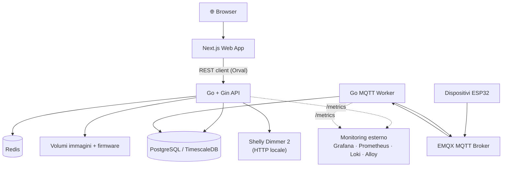

# GrowLab

> Piattaforma **local-first** per la gestione di piante, sensori IoT e operazioni da homelab.

[](#stato-del-progetto)
[](#licenza)
[](#contribuire)
[](#stack-tecnologico)

GrowLab è una piattaforma locale per homelab dedicata alla gestione di **piante**, **zone di coltivazione**, **sensori IoT**, **illuminazione**, **immagini**, **firmware ESP32** e **dati storici** su TimescaleDB.

Il progetto nasce per girare in **LAN/VPN**, con servizi separati per applicazione, database e monitoring. L'obiettivo non è creare una piattaforma cloud generica, ma un sistema **controllabile, ispezionabile e sicuro** per un homelab reale.

---

## Indice

- [Visione](#visione)
- [Caratteristiche principali](#caratteristiche-principali)
- [Architettura](#architettura)
- [Stack tecnologico](#stack-tecnologico)
- [Moduli](#moduli)
- [Struttura del repository](#struttura-del-repository)
- [Prerequisiti](#prerequisiti)
- [Quick start](#quick-start)
- [Configurazione](#configurazione)
- [Comandi disponibili](#comandi-disponibili)
- [Deploy](#deploy)
- [Backup e restore](#backup-e-restore)
- [Sicurezza](#sicurezza)
- [Monitoring esterno](#monitoring-esterno)
- [Documentazione](#documentazione)
- [Contribuire](#contribuire)
- [Licenza](#licenza)

---

## Visione

GrowLab tiene insieme tre mondi che di solito vivono in strumenti separati:

| Ambito | Cosa copre |
| --- | --- |
| **Plant care** | Cura, storico e timeline delle piante e delle zone di coltivazione |
| **IoT telemetry** | Sensoristica, firmware ESP32, ingestione MQTT e gestione OTA |
| **Homelab operations** | Deploy locale, backup, hardening e osservabilità |

Il principio guida è **local-first**: i dati restano in casa, i servizi non sono pensati per essere esposti su internet e ogni automazione potenzialmente pericolosa (irrigazione, AI) è disattivata di default.

---

## Caratteristiche principali

- 🌱 **Gestione piante e zone** — CRUD completo, profili target, timeline con immagini, eventi e checklist.
- 📡 **Telemetria IoT** — ingestione MQTT di sensori ESP32 con heartbeat, status e calibrazione.
- 💡 **Controllo illuminazione** — integrazione diretta con Shelly Dimmer 2 via API HTTP locale.
- 📦 **Distribuzione firmware OTA** — canali `dev` / `beta` / `stable`, job metadata e modalità dry-run.
- 📊 **Dashboard web** — grafici real-time con tema chiaro, scuro e di sistema.
- 🗄️ **Serie temporali** — storico dei dati su PostgreSQL + TimescaleDB.
- 🔒 **Sicuro per design** — moduli rischiosi disattivati di default e binding limitato alla LAN.
- 🔭 **Pronto per il monitoring** — espone metriche `/metrics` e log per uno stack di osservabilità esterno.

### Stato del progetto

**MVP locale avanzato.** Il progetto è funzionante e utilizzabile in un ambiente locale.

<details>
<summary><strong>✅ Implementato</strong></summary>

- Monorepo applicativo
- Backend Go + Gin
- Worker Go MQTT
- Frontend Next.js (App Router)
- Contratto OpenAPI 3.0.3
- Client TypeScript generato con Orval
- Database PostgreSQL/TimescaleDB con migrazioni goose
- Query type-safe generate con sqlc
- Firmware ESP32 (PlatformIO)
- Upload immagini e firmware su volumi Docker
- Dashboard web con grafici e temi chiaro/scuro/sistema
- Integrazione con monitoring esterno
- Script di backup/restore e baseline di sicurezza

</details>

<details>
<summary><strong>🚧 Volutamente non attivo (predisposto)</strong></summary>

- Autenticazione
- Irrigazione reale e automazioni pompa
- AI / Ollama
- Rules engine operativo
- Kiosk mode
- Monitoring VM/Proxmox
- Export avanzati

Questi moduli sono **predisposti ma disattivati** per scelta progettuale: la loro attivazione richiede una configurazione consapevole e, in alcuni casi, hardware reale.

</details>

---

## Architettura



**Flusso dati in sintesi:**

1. Il **browser** carica la web app Next.js.
2. La web app comunica con l'**API Go/Gin** tramite un client REST generato automaticamente da Orval.
3. L'API persiste i dati su **PostgreSQL/TimescaleDB**, usa **Redis** come cache, gestisce i **volumi** di immagini e firmware e comanda l'**illuminazione** via HTTP.
4. I dispositivi **ESP32** pubblicano telemetria su **EMQX (MQTT)**; il **worker Go** la consuma e la scrive nel database.
5. API e worker espongono metriche `/metrics` consumate da uno **stack di monitoring esterno** (vedi [Monitoring esterno](#monitoring-esterno)).

> Il database principale **non è containerizzato** insieme all'app: vive su un host dedicato esterno.

---

## Stack tecnologico

| Area | Tecnologia |
| --- | --- |
| **Frontend** | Next.js (App Router), TypeScript, TailwindCSS, shadcn/ui |
| **Grafici** | Recharts |
| **Data fetching** | TanStack Query |
| **API** | Go, Gin |
| **Worker** | Go, Eclipse Paho MQTT |
| **Database** | PostgreSQL + TimescaleDB |
| **Accesso DB** | pgx + sqlc |
| **Migrazioni** | goose |
| **Contratto API** | OpenAPI 3.0.3 |
| **Client generato** | Orval |
| **MQTT broker** | EMQX |
| **Cache** | Redis |
| **Firmware** | ESP32 + PlatformIO (Arduino framework) |
| **Illuminazione** | Shelly Dimmer 2 (API HTTP locale) |
| **Deploy** | Docker Compose |
| **Monitoring** | Stack esterno (repo separato) |

---

## Moduli

### 📊 Dashboard
- Vista operativa su stato API, alert, zone, dispositivi, eventi e firmware.
- Grafici con Recharts.
- Tema chiaro / scuro / di sistema.
- Polling lato frontend con TanStack Query.

### 🌱 Piante e zone
- CRUD di piante e zone.
- Profili target per zona.
- Storico salute pianta (inserimento manuale).
- Eventi pianta e checklist manuali.
- Timeline con immagini e metadati di crescita.
- Plant Wiki di base.

### 📡 Dispositivi e sensori
- Registrazione dispositivi ESP32.
- Heartbeat e *last seen*.
- Capability model per dispositivo.
- Calibrazione sensori.
- Ingestione MQTT di telemetria, heartbeat, status e stato OTA.

### 💡 Illuminazione
- Integrazione Shelly Dimmer 2 via HTTP locale.
- Comandi on / off / brightness.
- Profili di illuminazione.
- Eventi di lighting persistiti.

### 📦 Firmware e OTA
- Upload firmware su volume dedicato.
- Canali di rilascio `dev`, `beta`, `stable`.
- Metadati dei job OTA e modalità **dry-run**.
- Worker predisposto per lo stato OTA.
- **Nessun update automatico forzato** dal backend.

### 💧 Irrigazione *(predisposto, disattivo)*
- Feature flag disabilitati di default.
- API di safety status e UI in sola lettura.
- `manual-run` restituisce sempre `IRRIGATION_DISABLED`.
- Nessun comando pompa e nessun publish MQTT di irrigazione.

### 🤖 AI *(futuro, disattivo)*
- `GROWLAB_FEATURE_AI=false` di default.
- Il servizio `growlab-ollama` vive dietro il Compose profile `ai`.
- Ollama non espone porte host.
- Nessun endpoint API, nessuna UI e nessuna automazione AI.

---

## Struttura del repository

```text
.
├── apps/
│   ├── api/                 # API Go + Gin
│   └── web/                 # Web app Next.js
├── workers/
│   └── growlab-worker/      # Worker MQTT in Go
├── firmware/
│   └── esp32-growlab/       # Firmware ESP32 (PlatformIO)
├── packages/
│   └── openapi-client/      # Client TypeScript generato da Orval
├── database/
│   ├── migrations/          # Migrazioni goose
│   ├── queries/             # Query sqlc
│   └── generated/           # Codice Go generato da sqlc
├── infrastructure/
│   ├── docker/              # Docker Compose dell'app
│   ├── mqtt/                # Configurazione MQTT (placeholder)
│   └── scripts/             # Backup, restore, controlli di sicurezza
├── openapi/
│   └── growlab.openapi.yaml # Contratto OpenAPI
├── docs/                    # Documentazione e runbook
└── prompts/
```

---

## Prerequisiti

- **Go**
- **pnpm**
- **Docker** + Docker Compose plugin
- **PostgreSQL / TimescaleDB** esterno
- **goose** (migrazioni)
- **sqlc** (generazione query)
- **Node.js** compatibile con Next.js
- **PlatformIO** (per il firmware ESP32)

> Il `Makefile` cerca automaticamente `goose` e `sqlc` installati via `go install` in `$HOME/go/bin`.

---

## Quick start

```bash
# 1. Clona il repository
git clone https://github.com/MicheliAndrea/growlab.git
cd growlab

# 2. Configura l'ambiente
cp .env.example .env
# modifica .env con i tuoi parametri (vedi sezione Configurazione)

# 3. Genera codice e client
make sqlc
make openapi-generate

# 4. Applica le migrazioni (assicurati che .env punti al DB corretto!)
make migrate-up

# 5. Avvia i servizi in sviluppo (in terminali separati)
make dev-api
make dev-worker
make dev-web
```

---

## Configurazione

**1. Copia il file di esempio:**

```bash
cp .env.example .env
```

**2. Imposta almeno questi parametri:**

```dotenv
GROWLAB_DB_HOST=<host-del-database>
GROWLAB_DB_PORT=5432
GROWLAB_DB_NAME=growlab
GROWLAB_DB_USER=growlab
GROWLAB_DB_PASSWORD=change-me
GROWLAB_DB_SSLMODE=require

GROWLAB_LAN_BIND=127.0.0.1
GROWLAB_CORS_ORIGINS=http://localhost:3000
```

**3. Mantieni disattivati i moduli non progettati per la produzione:**

```dotenv
GROWLAB_FEATURE_AUTH=false
GROWLAB_FEATURE_AI=false
GROWLAB_FEATURE_IRRIGATION_MANUAL=false
GROWLAB_FEATURE_IRRIGATION_AUTOMATION=false
```

---

## Comandi disponibili

### Generazione codice

```bash
make sqlc              # Genera il codice Go dalle query SQL
make openapi-generate  # Genera il client TypeScript da OpenAPI
```

### Database

```bash
make migrate-up        # Applica le migrazioni
make migrate-down      # Annulla l'ultima migrazione
```

> ⚠️ **Attenzione:** `make migrate-up` modifica il database configurato in `.env`. Eseguilo solo quando `.env` punta al database corretto.

### Sviluppo

```bash
make dev-web           # Avvia la web app
make dev-api           # Avvia l'API
make dev-worker        # Avvia il worker MQTT
```

### Build e test *(intenzionalmente manuali)*

```bash
go test ./...
go build ./...
pnpm build
make build
make test
```

### Validazione deploy

```bash
make docker-config     # Valida la configurazione Docker Compose
make security-check    # Esegue i controlli di sicurezza
```

---

## Deploy

La configurazione Docker Compose dell'applicazione si trova in:

```text
infrastructure/docker/docker-compose.yml
```

**Validazione prima dell'avvio:**

```bash
make docker-config
make security-check
```

**Avvio:**

```bash
docker compose -f infrastructure/docker/docker-compose.yml up -d
```

> Il database principale **non è containerizzato** in questa Compose: deve essere fornito esternamente.

Vedi anche [`docs/DEPLOYMENT_RUNBOOK.md`](docs/DEPLOYMENT_RUNBOOK.md).

---

## Backup e restore

**Backup:**

```bash
make backup
```

**Restore:**

```bash
GROWLAB_RESTORE_CONFIRM=restore bash infrastructure/scripts/growlab_restore.sh /path/to/backup
```

Il backup include:

- Dump di PostgreSQL
- Volumi di immagini e firmware
- Configurazione Docker di GrowLab
- File `.env` locali (se presenti)
- Bundle Git

> Lo stack di monitoring viene salvato separatamente, nel proprio repository.

📄 Approfondimenti: [`docs/BACKUP_RESTORE.md`](docs/BACKUP_RESTORE.md)

---

## Sicurezza

GrowLab adotta un approccio **secure-by-default**. Rispetta queste regole:

- 🔐 **Nessuna autenticazione nell'MVP** → usalo **solo in LAN/VPN**.
- 🚫 **Non esporre** i servizi GrowLab su internet.
- 🔒 **Redis e Ollama** non pubblicano porte host.
- 🛡️ **MQTT e la dashboard EMQX** devono restare in LAN/VPN.
- 🎯 **CORS** deve puntare solo agli origin reali.
- 🤐 Tratta **`.env` e i backup come segreti**.
- ⏸️ **Irrigazione e AI** restano disabilitate finché non sono configurate consapevolmente.

📄 Dettagli: [`docs/SECURITY_BASELINE.md`](docs/SECURITY_BASELINE.md)

---

## Monitoring esterno

L'osservabilità generica dell'homelab **non vive in questo repository**: risiede in un repo dedicato che contiene Grafana, Prometheus, Loki, Alloy, dashboard e service discovery.

GrowLab espone solo le **superfici monitorabili**:

- Endpoint metriche `growlab-api /metrics`
- Endpoint metriche `growlab-worker /metrics`
- Log dei container leggibili da Alloy remoto
- Datasource PostgreSQL/TimescaleDB per Grafana

📄 Dettagli: [`docs/MONITORING_INTEGRATION.md`](docs/MONITORING_INTEGRATION.md)

---

## Documentazione

### Principale
- [`docs/IMPLEMENTATION_STATUS.md`](docs/IMPLEMENTATION_STATUS.md) — stato di implementazione
- [`docs/NEXT_STEPS.md`](docs/NEXT_STEPS.md) — prossimi passi
- [`docs/DECISIONS.md`](docs/DECISIONS.md) — decisioni architetturali
- [`docs/STEP_19_FINAL_AUDIT.md`](docs/STEP_19_FINAL_AUDIT.md) — audit finale

### Roadmap
- [`docs/STEP_20_FEATURE_BACKLOG.md`](docs/STEP_20_FEATURE_BACKLOG.md) — feature backlog
- [`docs/STEP_21_RULES_ENGINE_FUTURE.md`](docs/STEP_21_RULES_ENGINE_FUTURE.md) — rules engine
- [`docs/STEP_22_SENSOR_CALIBRATION.md`](docs/STEP_22_SENSOR_CALIBRATION.md) — calibrazione sensori
- [`docs/STEP_23_KIOSK_MODE.md`](docs/STEP_23_KIOSK_MODE.md) — kiosk mode
- [`docs/STEP_24_GRAFANA_DASHBOARDS.md`](docs/STEP_24_GRAFANA_DASHBOARDS.md) — dashboard Grafana
- [`docs/STEP_25_DEVICE_PROVISIONING.md`](docs/STEP_25_DEVICE_PROVISIONING.md) — provisioning dispositivi

---

## Contribuire

GrowLab è un progetto **open source** rilasciato sotto licenza MIT: puoi usarlo, studiarlo, modificarlo e redistribuirlo, inclusi fork personali o adattamenti per il tuo homelab.

Resta comunque pensato per ambienti locali e richiede una configurazione consapevole prima di essere esposto in rete.

Contributi benvenuti:

- 🐛 Bug report riproducibili
- 📚 Miglioramenti alla documentazione
- 📊 Dashboard o pannelli operativi
- 🔌 Integrazioni con nuovi sensori
- 🛡️ Hardening del deploy
- 🧪 Test mirati su API, worker e frontend

---

## Licenza

Distribuito sotto licenza **MIT**. Vedi [`LICENSE`](LICENSE) per i dettagli.
