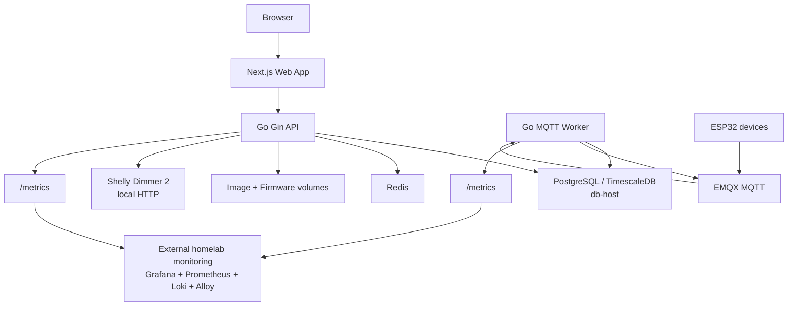
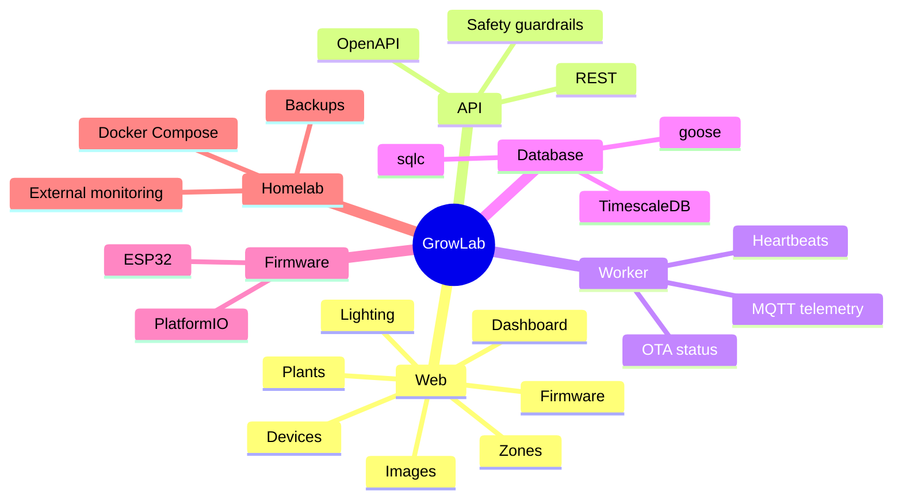

<h1 align="center">GrowLab</h1>

<p align="center">
  Local-first plant, IoT, firmware and homelab operations platform.
</p>

<p align="center">
  
  
  
  
</p>

---

GrowLab is an open source, local-first platform for managing plants, grow zones, IoT sensors, lighting, images, ESP32 firmware and historical telemetry on PostgreSQL/TimescaleDB.

It is designed for LAN/VPN homelabs where the application, database and monitoring stack can live on separate hosts. GrowLab is not a cloud SaaS template: it is built to be inspectable, self-hosted and conservative around physical automation.

## Vision

```text
Plant care + IoT telemetry + local operations + homelab observability
```

GrowLab connects four practical areas:

- plant care, events, health history and manual checklists
- ESP32 devices, sensors, calibration and telemetry
- lighting, firmware, OTA metadata and operational dashboards
- external homelab monitoring through standard metrics/logs surfaces

## Project Status

Advanced local MVP.

Implemented:

- application monorepo
- Go + Gin API
- Go MQTT worker
- Next.js App Router frontend
- OpenAPI contract
- TypeScript client generated with Orval
- PostgreSQL/TimescaleDB schema with goose migrations
- query generation with sqlc
- ESP32 PlatformIO firmware
- image and firmware upload to filesystem or Docker volumes
- dashboard charts with light, dark and system themes
- external monitoring integration points
- backup/restore scripts and security baseline docs

Intentionally not active by default:

- authentication
- real irrigation
- pump automation
- AI features
- automatic rules scheduler
- production kiosk lockdown
- generic homelab monitoring inside this repository

## Architecture



```text
Browser
  |
  v
Next.js Web App
  |
  | REST client generated by Orval
  v
Go Gin API
  |------ PostgreSQL/TimescaleDB on db-host
  |------ Redis
  |------ Image/Firmware Docker volumes
  |------ Shelly Dimmer 2 local HTTP API
  |
  v
Go MQTT Worker
  |
  v
EMQX MQTT
  |
  v
ESP32 devices

monitoring-host:
Grafana + Prometheus + Loki + Alloy
separate repository: homelab-monitoring
```

## Stack

| Area             | Technology                                             |
| ---------------- | ------------------------------------------------------ |
| Frontend         | Next.js App Router, TypeScript, TailwindCSS, shadcn/ui |
| Charts           | Recharts                                               |
| Data fetching    | TanStack Query                                         |
| API              | Go, Gin                                                |
| Worker           | Go, Eclipse Paho MQTT                                  |
| Database         | PostgreSQL + TimescaleDB                               |
| DB access        | pgx + sqlc                                             |
| Migrations       | goose                                                  |
| API contract     | OpenAPI 3.0.3                                          |
| Client generated | Orval                                                  |
| MQTT             | EMQX                                                   |
| Cache            | Redis                                                  |
| Firmware         | ESP32 PlatformIO + Arduino                             |
| Lighting         | Shelly Dimmer 2 local HTTP API                         |
| App deploy       | Docker Compose                                         |
| Monitoring       | External repository/service stack                      |

## Project Map



## Main Modules

### Dashboard

- API health, alerts, zones, plants, devices, telemetry and firmware overview
- Recharts dashboards
- light, dark and system theme support
- TanStack Query polling
- latest telemetry and sensor coverage charts

### Plants and Zones

- CRUD for plants and zones
- zone target profiles with one active profile per zone
- manual plant health history
- plant events
- manual tasks and checklist status updates
- plant photo timeline
- image metadata, tags and growth tracking metadata
- basic Plant Wiki

### Devices and Sensors

- registered ESP32 devices
- heartbeat and last-seen tracking
- device capability model with manual enable/disable
- device provisioning create, claim, revoke and expire flow
- token hashes stored server-side; raw provisioning token returned only once
- sensor calibration records with confirm, retire and reopen states
- telemetry, heartbeat, device status and OTA status ingestion over MQTT

### System Operations

- global system event timeline
- system alerts with `active`, `acknowledged` and `resolved` states
- manual alert/event creation in the Operations console
- rules engine MVP for manual evaluation and safe actions only
- no automatic scheduler and no physical actuation from rules

### Lighting

- Shelly Dimmer 2 integration over local HTTP
- on/off/brightness commands
- lighting profiles and profile steps
- one default lighting profile per zone
- persisted lighting events

### Firmware and OTA

- firmware upload to a dedicated volume
- `dev`, `beta` and `stable` channels
- configurable default firmware channel
- artifact download endpoint
- OTA job metadata with prepared MQTT command payload
- OTA dry-run compatibility report
- worker-side OTA status tracking
- no automatic firmware update dispatch forced by the backend

### Irrigation

The irrigation module is scaffolded but disabled.

- feature flags disabled by default
- safety status API
- read-only UI
- `manual-run` always returns `IRRIGATION_DISABLED`
- no pump commands
- no irrigation MQTT publishing

### AI

AI/Ollama support is future work.

- `GROWLAB_FEATURE_AI=false` by default
- optional Compose `ai` profile placeholder
- no AI API endpoints
- no AI UI
- no AI automation

## Related Monitoring Repository

Generic homelab monitoring should not live inside this repository.

Recommended separate repository:

```text
homelab-monitoring
```

That repository can own Grafana, Prometheus, Loki, Alloy, dashboards and service-discovery files. GrowLab only exposes monitorable surfaces:

- `growlab-api /metrics`
- `growlab-worker /metrics`
- container logs readable by an external log agent
- PostgreSQL/TimescaleDB datasource for Grafana

See [docs/MONITORING_INTEGRATION.md](docs/MONITORING_INTEGRATION.md).

## Repository Structure

```text
apps/
  api/                 Go Gin API
  web/                 Next.js web app
workers/
  growlab-worker/      Go MQTT worker
firmware/
  esp32-growlab/       PlatformIO ESP32 firmware
packages/
  openapi-client/      Orval generated client package
database/
  migrations/          goose migrations
  queries/             sqlc queries
  generated/           sqlc generated Go code
infrastructure/
  docker/              app Docker Compose
  mqtt/                MQTT-related config placeholder
  scripts/             backup, restore, security checks
docs/                  step docs and runbooks
openapi/
  growlab.openapi.yaml
prompts/
```

## Prerequisites

- Go
- pnpm
- Docker with the Docker Compose plugin
- PostgreSQL/TimescaleDB
- goose
- sqlc
- Node.js compatible with the project Next.js version
- PlatformIO for ESP32 firmware work

The Makefile also tries to locate `goose` and `sqlc` installed via `go install` in `$HOME/go/bin`.

## Configuration

1. Copy the example environment file:

```bash
cp .env.example .env
```

2. Configure at least:

```env
GROWLAB_DB_HOST=db-host
GROWLAB_DB_PORT=5432
GROWLAB_DB_NAME=growlab
GROWLAB_DB_USER=growlab
GROWLAB_DB_PASSWORD=change-me
GROWLAB_DB_SSLMODE=require

GROWLAB_LAN_BIND=127.0.0.1
GROWLAB_CORS_ORIGINS=http://localhost:3000
```

3. Keep unfinished or safety-critical modules disabled unless you intentionally design and test them:

```env
GROWLAB_FEATURE_AUTH=false
GROWLAB_FEATURE_AI=false
GROWLAB_FEATURE_IRRIGATION_MANUAL=false
GROWLAB_FEATURE_IRRIGATION_AUTOMATION=false
```

## Useful Commands

```bash
make sqlc
make openapi-generate
make docker-config
make security-check
```

Database migrations:

```bash
make migrate-up
make migrate-down
```

`make migrate-up` applies changes to the configured database. Run it only when `.env` points to the intended database.

Development helpers:

```bash
make dev-web
make dev-api
make dev-worker
```

Heavy commands are intentionally manual:

```bash
go test ./...
go build ./...
pnpm build
make build
make test
```

## Deployment

The application Compose file lives at:

```text
infrastructure/docker/docker-compose.yml
```

Validate configuration:

```bash
make docker-config
make security-check
```

Start manually:

```bash
docker compose -f infrastructure/docker/docker-compose.yml up -d
```

The primary database is not containerized in the application Compose file by default. Point GrowLab at your own PostgreSQL/TimescaleDB host.

## Backup and Restore

Backup:

```bash
make backup
```

Restore:

```bash
GROWLAB_RESTORE_CONFIRM=restore bash infrastructure/scripts/growlab_restore.sh /path/to/backup
```

The backup includes PostgreSQL dumps, image/firmware volumes, Docker configuration, local environment files if present and a Git bundle.

The external homelab monitoring repository should be backed up separately.

See:

- [docs/BACKUP_RESTORE.md](docs/BACKUP_RESTORE.md)
- [docs/DEPLOYMENT_RUNBOOK.md](docs/DEPLOYMENT_RUNBOOK.md)
- [docs/SECURITY_BASELINE.md](docs/SECURITY_BASELINE.md)

## Security Guardrails

- No authentication in the MVP: use LAN/VPN only.
- Do not expose GrowLab services directly to the internet.
- Redis and Ollama must not publish public host ports.
- MQTT and the EMQX dashboard must stay on LAN/VPN.
- CORS must point only to real frontend origins.
- Treat `.env` files and backups as secrets.
- Keep irrigation and AI disabled by default.
- Review physical automation changes carefully before enabling any actuator.

## Open Source

GrowLab is released under the MIT license.

You can use it, study it, modify it and redistribute it, including personal forks or homelab-specific adaptations. It is still a local infrastructure project, so deployments should be reviewed before exposing any surface beyond a trusted network.

Useful contributions include:

- reproducible bug reports
- documentation improvements
- dashboard and workflow improvements
- new sensor integrations
- deployment hardening
- focused API, worker and frontend tests

See:

- [CONTRIBUTING.md](CONTRIBUTING.md)
- [SECURITY.md](SECURITY.md)
- [CODE_OF_CONDUCT.md](CODE_OF_CONDUCT.md)

## Documentation

Main documents:

- [docs/IMPLEMENTATION_STATUS.md](docs/IMPLEMENTATION_STATUS.md)
- [docs/NEXT_STEPS.md](docs/NEXT_STEPS.md)
- [docs/STEP_19_FINAL_AUDIT.md](docs/STEP_19_FINAL_AUDIT.md)
- [docs/DECISIONS.md](docs/DECISIONS.md)

Roadmap and future work:

- [docs/STEP_20_FEATURE_BACKLOG.md](docs/STEP_20_FEATURE_BACKLOG.md)
- [docs/STEP_21_RULES_ENGINE_FUTURE.md](docs/STEP_21_RULES_ENGINE_FUTURE.md)
- [docs/STEP_22_SENSOR_CALIBRATION.md](docs/STEP_22_SENSOR_CALIBRATION.md)
- [docs/STEP_23_KIOSK_MODE.md](docs/STEP_23_KIOSK_MODE.md)
- [docs/STEP_24_GRAFANA_DASHBOARDS.md](docs/STEP_24_GRAFANA_DASHBOARDS.md)
- [docs/STEP_25_DEVICE_PROVISIONING.md](docs/STEP_25_DEVICE_PROVISIONING.md)

## License

MIT. See [LICENSE](LICENSE).
